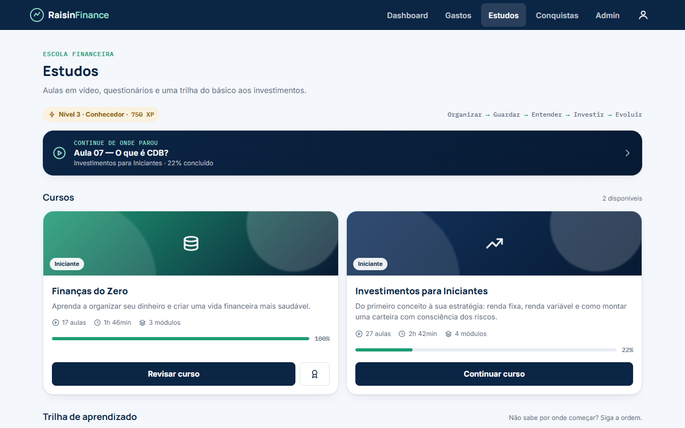
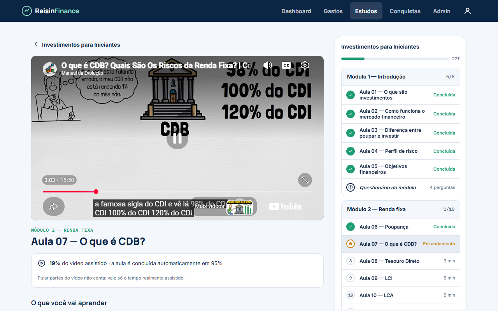
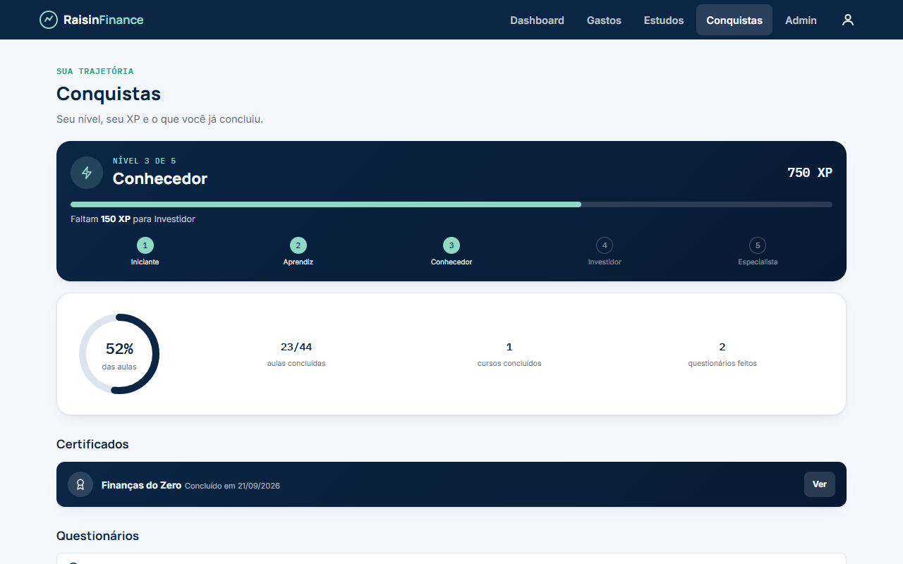
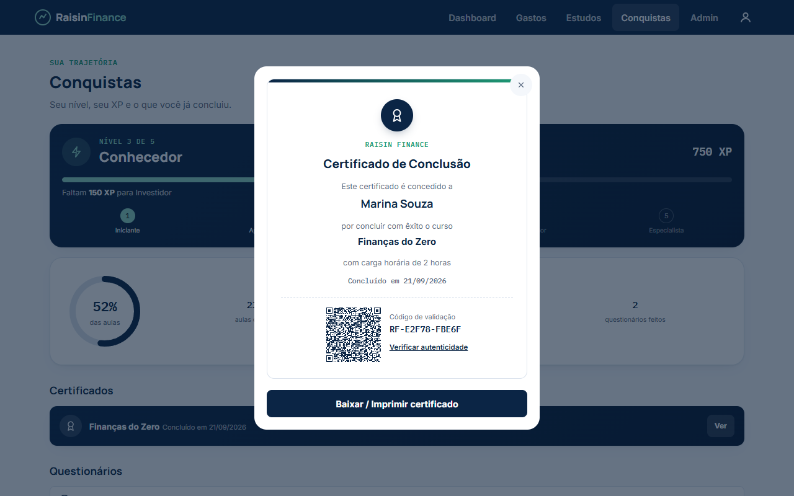
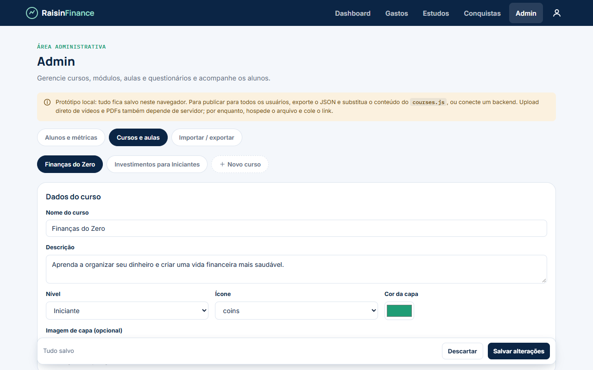
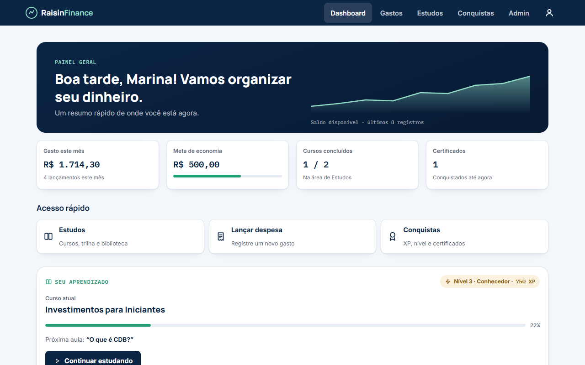
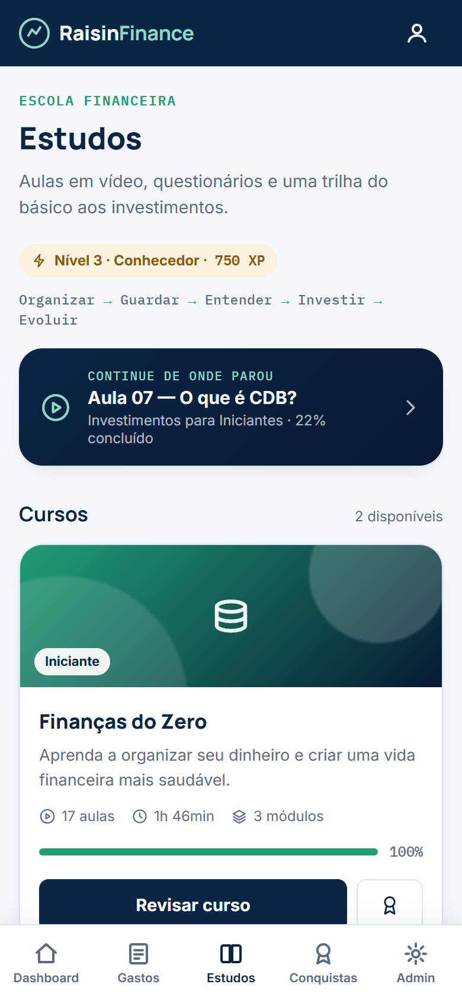
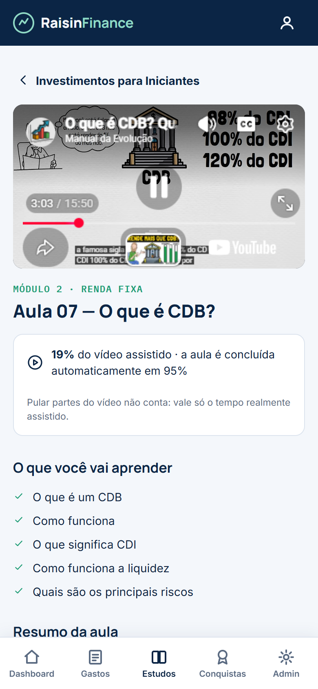
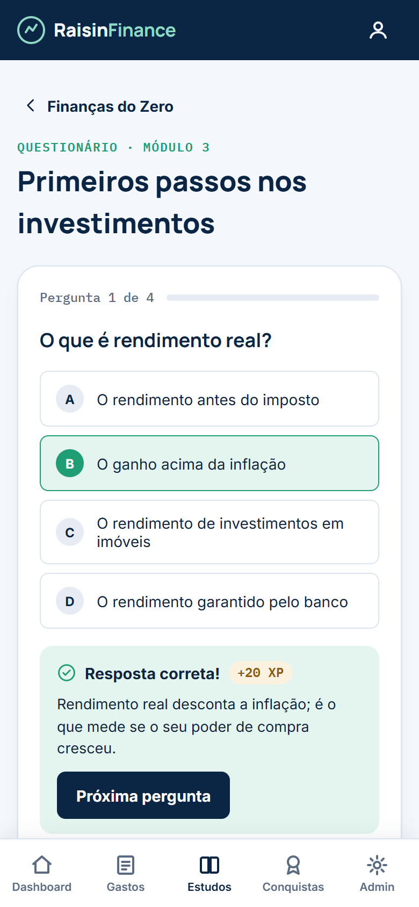

<div align="center">

# Raisin Finance

**Controle do dinheiro e escola financeira no mesmo lugar.**

Registre seus gastos, acompanhe o orçamento e aprenda de verdade, com aulas em vídeo,
questionários, trilha guiada e certificado, do primeiro orçamento aos primeiros investimentos.

[**Abrir o site →**](https://vihni7.github.io/Raisin-finance/)




</div>

---

## O que dá para fazer

**Organizar → Guardar → Entender → Investir → Evoluir**

| | |
|---|---|
| **Dashboard** | Gasto do mês, meta de economia, cursos concluídos e um card que leva direto para a próxima aula. |
| **Gastos** | Lançamento por categoria, limite mensal e barras de orçamento que mudam de cor quando o gasto aperta. |
| **Estudos** | 2 cursos, 7 módulos e 44 aulas em vídeo, cada uma com objetivos, resumo e material complementar. |
| **Trilha** | 8 passos em sequência para quem não sabe por onde começar: da organização financeira à diversificação. |
| **Questionários** | 4 perguntas ao fim de cada módulo, com correção na hora e explicação da resposta. |
| **Conquistas** | XP, 5 níveis (Iniciante → Especialista), certificados e histórico dos questionários. |
| **Biblioteca** | Artigos curtos, vídeos de 2 a 10 minutos e glossário com busca. |
| **Admin** | Cria e edita cursos, módulos, aulas e perguntas sem mexer no código, e acompanha o progresso dos alunos. |

### Cursos

- **Finanças do Zero** (17 aulas): renda e despesas, orçamento 50/30/20, controle de gastos, hábito de guardar, metas, reserva de emergência, risco, liquidez, inflação e juros compostos.
- **Investimentos para Iniciantes** (27 aulas): mercado financeiro, perfil de risco, poupança, CDB, Tesouro Direto, LCI/LCA, CDI, Selic, IPCA, ações, ETFs, FIIs, dividendos, diversificação e aportes.

Todo o conteúdo é educativo: a plataforma deixa claro que rentabilidade não é garantida e que cada investimento tem riscos diferentes.

## Como funciona o progresso

- **Aula concluída só com o vídeo realmente assistido.** A aula fecha sozinha em 95%, e a plataforma conta apenas o tempo reproduzido de verdade (até 2x de velocidade). Arrastar a barra até o fim não conta.
- **Aulas liberadas em ordem.** Cada aula libera a seguinte, e o questionário do módulo libera quando todas as aulas terminam.
- **Continue de onde parou.** O vídeo retoma no ponto em que você saiu, e o Dashboard mostra a próxima aula.
- **XP sem farm.** Cada ação rende XP uma única vez:

  | Ação | XP |
  |---|---|
  | Assistir uma aula | +10 |
  | Acertar uma pergunta | +20 |
  | Concluir um módulo | +50 |
  | Concluir um curso | +200 |

- **Certificado** com nome, curso, carga horária, data, código de validação e **QR Code** que abre uma página pública de verificação.

## Telas

<table>
<tr>
<td width="50%"><br><sub><b>Aula</b>: vídeo, % assistido e sumário com aulas concluídas, em andamento e bloqueadas.</sub></td>
<td width="50%"><br><sub><b>Conquistas</b>: nível, XP até o próximo nível e progresso geral.</sub></td>
</tr>
<tr>
<td><br><sub><b>Certificado</b>: código de validação e QR Code de verificação.</sub></td>
<td><br><sub><b>Admin</b>: cursos, módulos, aulas e questionários editáveis.</sub></td>
</tr>
<tr>
<td><br><sub><b>Dashboard</b>: finanças e estudos no mesmo painel.</sub></td>
<td>



<br><sub><b>No celular</b>: navegação inferior, testado de 320 px a 1440 px.</sub>
</td>
</tr>
</table>

## Rodando localmente

Não há build nem dependências. Só é preciso servir a pasta por HTTP, porque o player do YouTube não funciona abrindo o arquivo direto do disco:

```bash
git clone https://github.com/Vihni7/Raisin-finance.git
cd Raisin-finance
python -m http.server 8000
# abra http://localhost:8000
```

> **Primeiro acesso:** sem Supabase configurado, o site roda em modo demonstração e a primeira conta criada no navegador vira administradora. Com Supabase, o primeiro admin é definido no banco (veja [`docs/BACKEND.md`](docs/BACKEND.md)).

## Estrutura

```
index.html     telas (login, dashboard, gastos, estudos, aula, quiz, biblioteca, conquistas, admin)
style.css      estilos, mobile-first
script.js      lógica: navegação, progresso das aulas, XP, certificado, admin, gastos
backend.js     camada de dados: Supabase (modo nuvem) ou navegador (modo demonstração)
config.js      URL e chave pública do Supabase; vazio = modo demonstração
courses.js     conteúdo padrão: cursos, módulos, aulas, quizzes, trilha, artigos, vídeos e glossário
supabase/      banco (migração SQL com regras de acesso), funções do servidor e testes
docs/          guia do backend, documento de escopo e screenshots
```

O conteúdo fica separado da lógica. Para adicionar ou alterar cursos, use a aba **Admin**: no modo nuvem, o que o admin publica vale na hora para todos os alunos.

## Backend

Com o Supabase configurado, o sistema tem:

- **Contas de verdade:** cadastro, login, confirmação por e-mail e recuperação de senha.
- **Dados na nuvem:** progresso, XP e gastos acompanham a conta em qualquer aparelho.
- **Admin completo:** publica cursos para todos, envia vídeos e PDFs, vê o progresso de todos os alunos e promove outros administradores.
- **Certificado verificável:** emitido pelo servidor depois de conferir o progresso. O QR Code consulta o registro oficial.
- **Segurança no banco (RLS):** cada aluno só acessa os próprios dados, ninguém se promove a admin e ninguém emite certificado sozinho. As regras são cobertas por 39 testes automatizados.
- **LGPD:** o aluno exclui a própria conta e todos os dados pelo perfil.

Passo a passo de configuração em [`docs/BACKEND.md`](docs/BACKEND.md).

## Limitações conhecidas

- A medição dos 95% do vídeo roda no navegador, porque o YouTube não avisa o servidor. Quem manipular os próprios dados pela API consegue marcar aulas como vistas.
- No modo demonstração (sem Supabase), contas, progresso e certificados ficam só no navegador, e o código do certificado detecta apenas alterações casuais.
- O plano gratuito do Supabase limita o envio de e-mails e o tamanho dos arquivos (50 MB cada).

## Créditos

Desenvolvido por **Vinicius** e **Bernardo Malta**. As aulas usam vídeos públicos de canais brasileiros de educação financeira no YouTube, com os créditos exibidos no próprio player.
